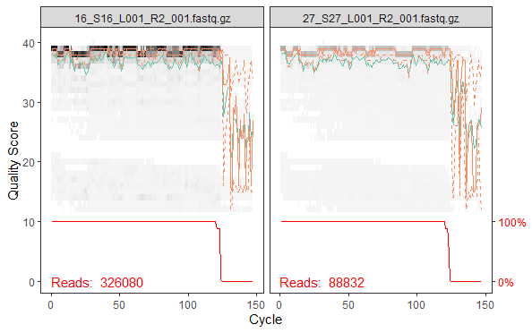
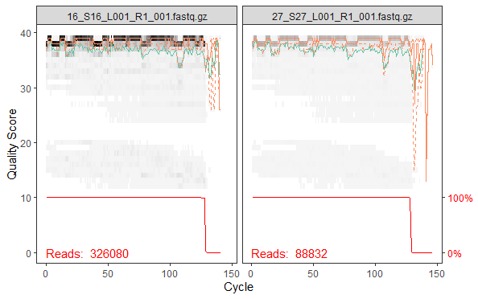
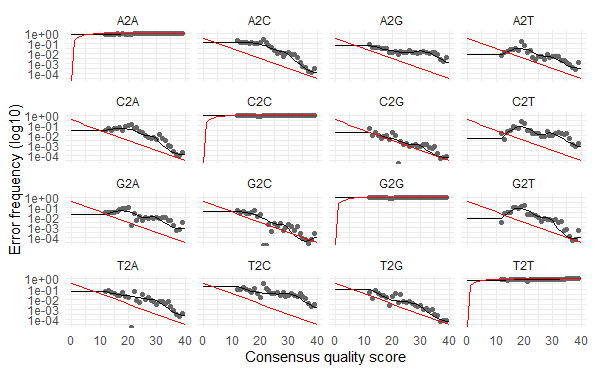

### Install and Load Packages
 First we need to install DADA2 and other necessary packages

```sh
if (!require("BiocManager", quietly = TRUE))
  install.packages("BiocManager")
BiocManager::install(c("dada2", "phyloseq", "DECIPHER"))

install.packages("ggplot2")
install.packages("phangorn")
install.packages("phyloseq") 
install.packages("phangorn") 
install.packages("DECIPHER") 
install.packages("dplyr")
install.packages("writexl")
install.packages("stringr")
install.packages("tibble")
```
Then load the packages and verify you have the correct DADA2 version. It should be ver 1.30.0 or higher. 

```sh
library(dada2) 
library(ggplot2) 
library(phyloseq) 
library(phangorn) 
library(DECIPHER) 
library(dplyr)
library(writexl)
library(stringr)
library(tibble)

# Checking the version of dada2
packageVersion("dada2")
```

### Importing data
Extract the fastqs form the zip and put it into a folder named 'fastq'. In the script below, I'm using the folder name 'fastq' to define the variable 'path'. The R script is located in the directory outside of 'fastq'

```sh
path <- 'fastq'
list.files(path)
```
After you've run the script, the console should show all of your sample fastqs. I'm using other samples below. 

```sh
# [1] "16_S16_L001_R1_001.fastq" "16_S16_L001_R2_001.fastq"
# [3] "27_S27_L001_R1_001.fastq" "27_S27_L001_R2_001.fastq"
```

### Quality check
First we create two lists with the sorted name of the reads: one for the forward reads, one for the reverse reads.

```sh
raw_forward <- sort(list.files(path, pattern="_1.fastq",
                               full.names=TRUE))

raw_reverse <- sort(list.files(path, pattern="_2.fastq",
                               full.names=TRUE))
```

Extract the first element of a subset to set the sample name.

```sh
sample_names <- sapply(strsplit(basename(raw_forward), "_"),
                       `[`,  
                       1)

# Check whether the sample names are correct
sample_names
```

### Visualise the quality of our reads

Run the script one by one, first run the forward and after it's done do the reverse. It takes quite a while so no need to worry if nothing shows up as soon as you run it. 

```sh
plotQualityProfile(raw_forward[1:2])
plotQualityProfile(raw_reverse[1:2])
```
The plot should look like this. The top are for forwards, and the bottom for reverse.




### Naming and saving the output files
Dada2 requires us to define the name of our output files. Also, we need to place filtered files in filtered/ subdirectory.
```sh
filtered_path <- file.path(path, "filtered")

filtered_forward <- file.path(filtered_path,
                              paste0(sample_names, "_1_trimmed.fastq.gz"))

filtered_reverse <- file.path(filtered_path,
                              paste0(sample_names, "_2_trimmed.fastq.gz"))
```
Now if you check the 'fastq' folder in your device. There should be a new directory called 'filtered'. 

### Filtering and Trimming
Now run filterAndTrim. This time we use the standard filtering parameters:
  - maxN=0   -> After truncation, sequences with more than 0 Ns will be discarded. (DADA2 requires sequences contain no Ns)
  - truncQ = 2   -> Truncate reads at the first instance of a quality score less than or equal to 2
  - rm.phix = TRUE   -> Discard reads that match against the phiX genome
  - maxEE=c(2, 2)   -> After truncation, reads with higher than 2 “expected errors” will be   discarded
  - minLen = 60   -> Remove reads with length less than 60 (note these should have already   been removed by cutadapt)
  - multithread = TRUE   -> input files are filtered in parallel

Here, we defined the output as the variable 'out'. 

```sh
out <- filterAndTrim(raw_forward, filtered_forward, raw_reverse,
                     filtered_reverse, maxN = 0, maxEE = c(2, 2), 
                     truncQ = 2, minLen = 60, rm.phix = TRUE, compress = TRUE
                     , multithread = TRUE)
head(out)
```
The console should look like this 

```sh
reads.in reads.out
16_S16_L001_R1_001.fastq.gz   326080    323224
27_S27_L001_R1_001.fastq.gz    88832     88026
```
### Learn the Error Rates
The DADA2 algorithm depends on a parametric error model and every amplicon dataset has a slightly different error rate. The learnErrors of Dada2 learns the error model from the data and will help DADA2 to fits its method to your data
```
errors_forward <- learnErrors(filtered_forward, multithread=TRUE)
errors_reverse <- learnErrors(filtered_reverse, multithread=TRUE)
```
```
52641214 total bases in 411250 reads from 2 samples will be used for learning the error rates.
50429203 total bases in 411250 reads from 2 samples will be used for learning the error rates.
```
Then we visualise the estimated error rates
```
plotErrors(errors_forward, nominalQ=TRUE) +
  theme_minimal()
```
The plot should look like this.



### Dereplication
Dereplication combines all identical sequencing reads into into “unique sequences” with a corresponding “abundance”: the number of reads with that unique sequence. Dereplication substantially reduces computation time by eliminating redundant comparisons.
Again, you should run these script one by one, just to be careful. 
```
derep_forward <- derepFastq(filtered_forward, verbose=TRUE)
derep_reverse <- derepFastq(filtered_reverse, verbose=TRUE)
```
The console should look like this. 
```sh
# For forward
Dereplicating sequence entries in Fastq file: fastq_Clean/filtered/16_R1_trimmed.fastq.gz
Encountered 52466 unique sequences from 323224 total sequences read.
Dereplicating sequence entries in Fastq file: fastq_Clean/filtered/27_R1_trimmed.fastq.gz
Encountered 20658 unique sequences from 88026 total sequences read.

# For reverse
Dereplicating sequence entries in Fastq file: fastq_Clean/filtered/16_R2_trimmed.fastq.gz
Encountered 48243 unique sequences from 323224 total sequences read.
Dereplicating sequence entries in Fastq file: fastq_Clean/filtered/27_R2_trimmed.fastq.gz
Encountered 20297 unique sequences from 88026 total sequences read.
```

Name the derep-class objects by the sample names.
```
names(derep_forward) <- sample_names
names(derep_reverse) <- sample_names
```

### Sample inference
We are now ready to apply the core sequence-variant inference algorithm to the dereplicated data.
```
dada_forward <- dada(derep_forward, err=errors_forward, multithread=TRUE)
dada_reverse <- dada(derep_reverse, err=errors_reverse, multithread=TRUE)
```
```sh
# For forward
Sample 1 - 323224 reads in 52466 unique sequences.
Sample 2 - 88026 reads in 20658 unique sequences.

# For reverse
Sample 1 - 323224 reads in 48243 unique sequences.
Sample 2 - 88026 reads in 20297 unique sequences.
```
inspect the dada-class object
```
dada_forward[[1]]
```
```sh
dada-class: object describing DADA2 denoising results
# 141 sequence variants were inferred from 52466 input unique sequences.
# Key parameters: OMEGA_A = 1e-40, OMEGA_C = 1e-40, BAND_SIZE = 16
```

### Merge Paired-end Reads
Now that the reads are trimmed, dereplicated and error-corrected we can merge them together.
```
merged_reads <- mergePairs(dada_forward, derep_forward, dada_reverse,
                           derep_reverse, verbose=TRUE)
```
```sh
299887 paired-reads (in 337 unique pairings) successfully merged out of 321494 (in 1368 pairings) input.
70180 paired-reads (in 296 unique pairings) successfully merged out of 87335 (in 1367 pairings) input.
```

Inspect the merger data.frame from the first sample.
```
head(merged_reads[[1]])
```
```sh
# sequence
# 1  CACCGCGGTTATACGAGAGGCCCAAGTTGATAGACGCCGGCGTAAAGAGTGGTTAGGAAGTTTTTTAAAATAAAGCCGAATGCCCTCAGAACTGTCGTACGTACCCGAAGGCAAGAAGCCCCACTACGAAAGTGGCTTTATACCCCCGACCCCACGAAAGCTGCGAAA
# 2 CACCGCGGTTATACGAAAGGCTCAAGTTGATTGTACACGGCGTAAAGTGTGGTTAAGGAACTACCTAAACTAAAGCTGAACACTCTCAAAGCTGTCATACGCACCCGAGAAAATGAATCCCAACAACGAAAGTGGCTTTAAATACCCCGACCCCACGAAAGCTGTGGAA
# 3   CACCGCGGTTATACGAGCGGCTCAAGCTGATAGACATCGGCGTAAAGAGTGGTTAGGAAGTTCTTAAACTAAAGCCGAACGCTCTCAGAACTGTTATACGTACCCGAGAGCAAGAAGCCCCACTACGAAAGTGGCTTTATATTCCCGACCCCACGAAAGCTGCGAAA
# 4   CACCGCGGTTATACGAGAGGCTCAAGTTGATAGACATCGGCGTAAAGAGTGGTTAGGAAGTTTTTAAACTAAAGCCGAACGCCCTCAGAACTGTTATACGTACCCGAGAGCAAGAAGCCCCACTACGAAAGTGGCTTTATACCCCCGACCCCACGAAAGCTGCGAAA
# 5  CACCGCGGTTATACGAGAGGCTCAAGTTGACAAATTACGGCGTAAAGCGTGGTTAAGAGTATTTCAAAATAAAGTCGAATGCTTTCAAAGCTGTTATACGCACCCGAAAGTAAGAAGCCCAATTACGAAAGTAACTTTACACATTCTGACCCCACGAAAGCTAGGCCA
# 7   CACCGCGGTTATACGAGCGGCTCAAGCTGACAGACATCGGCGTAAAGAGTGGTTAGGAAGCTCTTAAATTAAAGCCGAACGCCCTCAGAACTGTTATACGTACCCGAGAGCAAGAAGCCCCACTACGAAAGTGGCTTTATACGCCCGACCCCACGAAAGCTGCGAAA
# abundance forward reverse nmatch nmismatch nindel prefer accept
# 1     74130       1       1     83         0      0      2   TRUE
# 2     58583       2       2     82         0      0      1   TRUE
# 3     38341       3       3     84         0      0      2   TRUE
# 4     27586       4       4     84         0      0      2   TRUE
# 5     25076       5       5     80         0      0      2   TRUE
# 7      8143       7       6     84         0      0      1   TRUE
```

### Construct Sequence Table
We can now construct a sequence table of our mouse samples, a higher-resolution version of the OTU table produced by traditional methods.
```
seq_table <- makeSequenceTable(merged_reads)
dim(seq_table)
```
```sh
# 2 600
```

Inspect distribution of sequence lengths.
```
table(nchar(getSequences(seq_table)))
```
```sh
128 166 167 168 169 171 172 174 175 
1   3 343 172  52   4   1  17   7 
```

### Remove Chimeras
The dada method used earlier removes substitutions and indel errors but chimeras remain. We remove the chimeras with
```
seq_table_nochim <- removeBimeraDenovo(seq_table, method='consensus',
                                       multithread=TRUE, verbose=TRUE)
```
```sh
# Identified 547 bimeras out of 600 input sequences.
```
```
dim(seq_table_nochim)
```
```sh
# 2 53
```

Which percentage of our reads did we keep?
```
sum(seq_table_nochim) / sum(seq_table)
```
```sh
# 0.8275799
```

As a final check of our progress, we’ll look at the number of reads that made it through each step in the pipeline
```
get_n <- function(x) sum(getUniques(x))

track <- cbind(out, sapply(dada_forward, get_n), sapply(merged_reads, get_n),
               rowSums(seq_table), rowSums(seq_table_nochim))

colnames(track) <- c('input', 'filtered', 'denoised', 'merged', 'tabled',
                     'nonchim')
rownames(track) <- sample_names
head(track)
```
```sh
# input filtered denoised merged tabled nonchim
# 16 326080   323224   322555 299887 299887  257927
# 27  88832    88026    87772  70180  70180   48333
```

### Extracting Denoised metadata to xlsx
```
write_xlsx(data.frame(track),"C:/Users/Asus/Documents/R_Projects/Metabarcoding Gajah/data/Denoised.xlsx")
```

Exracting raw ASV data 
```
write_xlsx(data.frame(seq_table_nochim),"C:/Users/Asus/Documents/R_Projects/Metabarcoding Gajah/data/seqtab_nochim.xlsx")
```

Tyding up and transposing ASV 
```
seq_table_nochim_trans <- as.data.frame(t(seq_table_nochim)) %>% 
  rownames_to_column(var = "sequence") %>% 
  rowid_to_column(var = "ASVNumber") %>% 
  mutate(ASVNumber = sprintf("asv%04d", ASVNumber)) %>% 
  mutate(sequence = str_replace_all(sequence, "(-|\\.)", ""))
```

Creating ASV files 
```
write_xlsx(seq_table_nochim_trans,"C:/Users/Asus/Documents/R_Projects/Metabarcoding Gajah/data/seqtab_nochim_trans.xlsx")
```

df <- seq_table_nochim_trans
seq_out <- Biostrings::DNAStringSet(df$sequence)

names(seq_out) <- df$ASVNumber

Biostrings::writeXStringSet(seq_out, str_c(path , "gajah_sequences.fasta"), 
                            compress = FALSE, width = 20000)

### Assign Taxonomy
Now we assign taxonomy to our sequences using the 16S database. You can download the fasta and txt file here.

```sh
taxa <- assignTaxonomy(seq_table_nochim, 
                       "taxa/16S_.fasta", 
                       multithread=TRUE, verbose = T)

taxa <- addSpecies(taxa, "taxa/16S_.fasta")
```

For inspecting the classification, removing sequence rownames for display only.
```sh
taxa_print <- taxa  
rownames(taxa_print) <- NULL
head(taxa_print)
```

Formatting data and read tables, transpose reads table
```
seq_table_nochim_transpose <- t(seq_table_nochim) 
```

Combine taxa and read tables
```
combined_table <- cbind(taxa, seq_table_nochim_transpose) 
```

Write into csv file
```
write.csv(taxa, file="taxa.csv") 
write.csv(seq_table_nochim, file="reads.csv") 
write.csv(seq_table_nochim_transpose, file="reads_t.csv") 
write.csv(combined_table, file="Combined_raw_ASVs_table.csv") 
```


### Save RData to be load in the future
Menyimpan variable dan data untuk bisa dimuat kembali
```
save.image("R_image")
```
